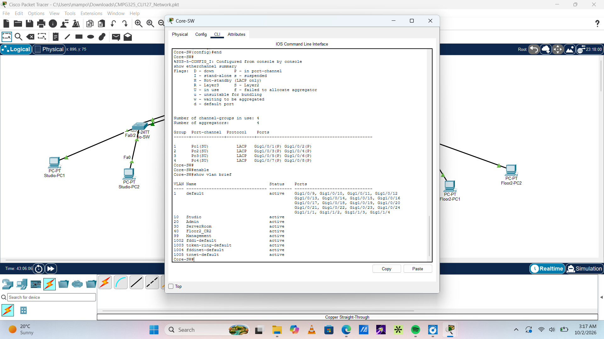

# CMPG325 Computer Networks — Milestone 1: Client Design Review

**Student Name:** SEMARA, K  
**Student Number:** 36233137  
**Project ID:** CMPG325-2026-127  
**Client ID:** CLI-127  
**Assigned Organisation:** North-West Community Radio FM (Mahikeng)  
**Industry:** Media  
**Assigned Subnet Block:** 172.30.82.0/23  
**Assigned Technical Challenge:** EtherChannel (Link Aggregation)  
**Submission Date:** 28 August 2026  

---

## 1. Client Requirements Analysis & Design Justification

### 1.1 Business Context & Problem Statement
North-West Community Radio FM is a media broadcasting station based in Mahikeng. Modern broadcasting environments require high-availability, low-latency, and scalable network architectures to support concurrent digital audio streams, live station feeds, dedicated broadcast management systems, and general administrative services. This project presents a structured network solution designed and simulated in Cisco Packet Tracer to fulfill the client's operational demands.

### 1.2 Client Scope & Operational Constraints
* **IP Addressing Assignment:** Subnet allocation strictly using `172.30.82.0/23`.
* **Design Constraint (Restricted Server Access):** Server room infrastructure must be physically and logically restricted to authorized IT personnel only.
* **Assigned Technical Challenge:** EtherChannel implementation using LACP (Link Aggregation Control Protocol) across switch inter-connects to eliminate network bottlenecks and provide link redundancy.
* **Client Change Request (CR2):** Seamless logical and physical network expansion to accommodate an additional floor/building area without disrupting the baseline operational architecture.

---

## 2. Network Topology Architecture

### 2.1 Physical Topology: Extended Hierarchical Star
The physical infrastructure uses an **Extended Hierarchical Star Topology**. A centralized Core/Distribution switch layer acts as the star hub, interconnecting access switches dedicated to specific operational zones:
* **Spoke 1:** Studio & On-Air Production Access Switch
* **Spoke 2:** Administration & Management Access Switch
* **Spoke 3:** Restricted Server Room Access Switch
* **Spoke 4 (CR2):** Additional Floor Expansion Access Switch
* ### 2.2 Physical Topology Justification
* **Centralized Control:** Simplifies network monitoring, troubleshooting, and policy enforcement at a single central point.
* **Redundancy & High Availability:** Inter-switch links utilize LACP EtherChannel. If one physical cable in a bundle fails, traffic instantly fails over to the remaining operational links without triggering Spanning Tree reconvergence.
* **Effortless Scalability:** Satisfying **Change Request CR2** requires running a dual-link trunk from the central star hub to the new floor access switch without re-architecting existing network segments.

---

## 3. Logical Network Topology & Security Plan

### 3.1 Logical Segmentation & Inter-VLAN Routing
* **IEEE 802.1Q VLAN Tagging:** Segregates broadcast domains across functional departments to enhance security and reduce broadcast overhead.
* **Centralized Routing via SVIs:** Switched Virtual Interfaces (SVIs) configured on the central Layer 3 Switch perform Inter-VLAN routing, serving as the logical default gateway for each subnet.
* **Port-Channel Interfaces:** Aggregated physical trunks operate as single logical `Port-Channel` interfaces running LACP in active mode.

### 3.2 Logical Access Control (Server Room Security)
To fulfill the server room access constraint, an **Extended Access Control List (ACL)** is applied at the SVI boundary of VLAN 30:
* **Permitted Traffic:** IP source traffic originating from VLAN 20 (IT Administration & Station Management).
* **Denied Traffic:** General station traffic originating from VLAN 10 (Studio) and VLAN 40 (CR2 Expansion) attempting to establish sessions with VLAN 30 IP ranges.

---

## 4. IP Addressing Scheme (VLSM Plan)

* **Assigned Block:** `172.30.82.0/23`
* **Total Usable Host Range:** `172.30.82.1` – `172.30.83.254`
* **Subnet Mask:** `255.255.254.0` (`/23`)

| VLAN ID | Department / Purpose | Network Address | Subnet Mask | Usable Host Range | Default Gateway |
| :--- | :--- | :--- | :--- | :--- | :--- |
| **VLAN 10** | Studio & On-Air Production | `172.30.82.0/25` | `255.255.255.128` | `172.30.82.1` – `172.30.82.126` | `172.30.82.1` |
| **VLAN 20** | Admin & Station Management | `172.30.82.128/25` | `255.255.255.128` | `172.30.82.129` – `172.30.82.254` | `172.30.82.129` |
| **VLAN 30** | Server Room (Restricted Access) | `172.30.83.0/26` | `255.255.255.192` | `172.30.83.1` – `172.30.83.62` | `172.30.83.1` |
| **VLAN 40** | CR2: Additional Floor Expansion | `172.30.83.64/26` | `255.255.255.192` | `172.30.83.65` – `172.30.83.126` | `172.30.83.65` |
| **VLAN 99** | Management & Native VLAN | `172.30.83.128/27` | `255.255.255.224` | `172.30.83.129` – `172.30.83.158` | `172.30.83.129` |
| **Reserved**| Future Allocation | `172.30.83.160/27` | `255.255.255.224` | N/A | N/A |

---

## 5. Milestone Tracking & Roadmap

- [x] **Milestone 1 (28 August 2026):** Requirements Analysis, Physical & Logical Topology Design, VLSM IP Addressing Plan, and Repository Initialization.
- [x] **Milestone 2 (02 October 2026):** Packet Tracer Topology Build, LACP EtherChannel Trunking, Inter-VLAN Routing, ACL Rules Configuration, and Functional Verification.
- [ ] **Final Submission (16 October 2026):** Fully Tested `.pkt` Mod

## Milestone 2: Implementation & Verification Evidence

### 1. Network Topology
Completed physical and logical layout featuring Core-SW, 4 Access Switches, 6 End PCs, and 1 Main Server.

---

### 2. LACP EtherChannel Verification
Verified active LACP trunk bundles (`Po1` through `Po4`) on `Core-SW` using `show etherchannel summary`.

---

### 3. Inter-VLAN Routing Verification
Successful 0% packet loss communication between different subnets (Admin-PC1 to Studio-PC1).

---

### 4. Extended ACL Access Control Verification
Verified that authorized traffic from Admin VLAN 20 is permitted to reach Main-Server, while unauthorized traffic from Studio VLAN 10 is blocked (`Destination host unreachable`).

---

### 5. Testing Summary Matrix
| Test Scenario | Source Device | Target Device | Expected Result | Actual Result | Status |
| :--- | :--- | :--- | :--- | :--- | :--- |
| **Inter-VLAN Routing** | Admin-PC1 (VLAN 20) | Studio-PC1 (VLAN 10) | ICMP Echo Reply | ICMP Echo Reply | **PASS** |
| **Authorized Server Access** | Admin-PC1 (VLAN 20) | Main-Server (VLAN 30) | ICMP Echo Reply | ICMP Echo Reply | **PASS** |
| **Restricted Server Access** | Studio-PC1 (VLAN 10) | Main-Server (VLAN 30) | Destination Unreachable | Destination Unreachable | **PASS** |
